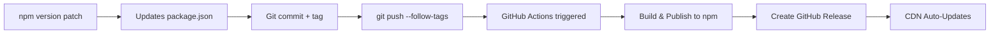

# 📦 Release Process

This package uses the **standard npm versioning workflow** - the most common approach used by npm packages.

## 🚀 How to Release (2 Simple Steps)

### Step 1: Bump Version Locally
```bash
# Choose one:
npm run release:patch  # 0.0.1 → 0.0.2 (bug fixes)
npm run release:minor  # 0.0.1 → 0.1.0 (new features)
npm run release:major  # 0.0.1 → 1.0.0 (breaking changes)
```

This automatically:
- ✅ Updates version in package.json
- ✅ Updates package-lock.json
- ✅ Creates a git commit: `chore(release): 0.0.2`
- ✅ Creates a git tag: `v0.0.2`

### Step 2: Push to GitHub
```bash
git push --follow-tags
```

This triggers GitHub Actions to automatically:
- ✅ Build the package
- ✅ Publish to npm registry
- ✅ Create GitHub release
- ✅ Update CDN (unpkg, jsDelivr)

## 📋 Complete Example

```bash
# 1. Make your changes
git add .
git commit -m "fix: resolve connection issue"

# 2. Bump version
npm run release:patch  # Creates v0.0.2

# 3. Push to trigger publish
git push --follow-tags

# 4. Done! Package is published to npm and CDN
```

## 🎯 Version Guidelines

| Change Type | Command | When to Use |
|------------|---------|-------------|
| **Patch** | `npm run release:patch` | Bug fixes, documentation |
| **Minor** | `npm run release:minor` | New features (backwards compatible) |
| **Major** | `npm run release:major` | Breaking changes |
| **Alpha** | `npm run release:alpha` | Early testing version |
| **Beta** | `npm run release:beta` | Pre-release testing |

## 🤖 Alternative: GitHub UI Release

You can also release directly from GitHub:
1. Go to Actions → "Publish to NPM"
2. Click "Run workflow"
3. Select version type (patch/minor/major)
4. Click "Run workflow"

## ✅ Pre-Release Checklist

Before releasing, ensure:
- [ ] Tests pass (if any)
- [ ] Build works: `npm run build`
- [ ] Examples work with new changes
- [ ] README is updated (if needed)

## 📊 Current Version

- **Current:** `0.0.1`
- **NPM:** [@iris-point/eye-tracking-core](https://www.npmjs.com/package/@iris-point/eye-tracking-core)
- **CDN:** [unpkg.com/@iris-point/eye-tracking-core](https://unpkg.com/@iris-point/eye-tracking-core/)

## 🔧 Setup Requirements

### One-Time Setup
1. **NPM Token**: Add `NPM_TOKEN` to GitHub Secrets
2. **npm login**: Ensure you're logged in locally
3. **Permissions**: Ensure you can publish to @iris-point

## 📝 What Happens Behind the Scenes



## 🆘 Troubleshooting

### "Permission denied" when publishing
- Check `NPM_TOKEN` in GitHub Secrets
- Verify @iris-point organization access

### Workflow not triggering
- Ensure you used `--follow-tags` when pushing
- Check Actions tab for any errors

### Version already exists
- You can't republish the same version
- Bump to next version number

## 📚 Version History

| Version | Date | Changes |
|---------|------|---------|
| 0.0.1 | Initial | Initial release |

---

**Remember:** This is the standard npm workflow used by thousands of packages. Simple, reliable, and well-understood by all npm users! 🎉